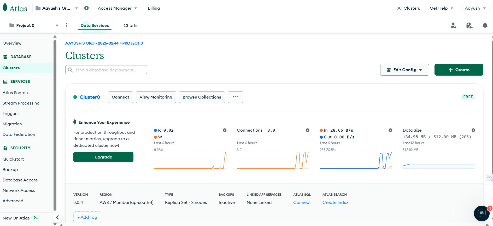
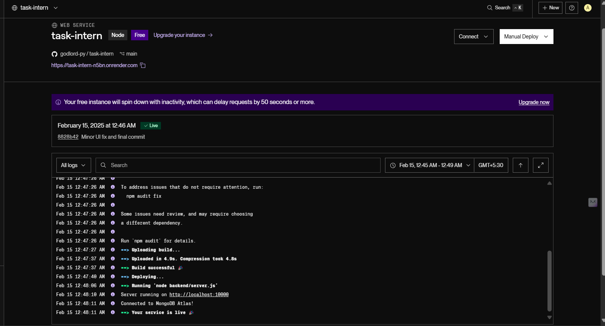

# Full-Stack Student Education Platform

## Overview
A comprehensive full-stack web application designed for student education management. Built with modern technologies including React.js, TypeScript, and Node.js, offering a robust and scalable solution.

### Tech Stack
**Frontend:**
- React.js with TypeScript
- Vite for build tooling
- Tailwind CSS for styling
- Modern React patterns and hooks
- Used React-routes for easy routing 
- Used Toastify for custom pop up messages

**Backend:**
- Node.js & Express.js
- MongoDB Atlas for database
- JWT for authentication
- RESTful API architecture

## Live Demo
- Frontend: [View Live Demo](https://studentedu-ui.netlify.app/)
- Backend API: [API Endpoint](https://task-intern-n5bn.onrender.com/)

## Getting Started

### Prerequisites
- Node.js (v14 or higher)
- npm 
- WSL (for Windows users)
- MongoDB Atlas account

### Frontend Setup

1. **Create React Application**
```bash
# Initialize project with Vite
npm create vite@latest my-app --template react-ts

# Navigate to project directory
cd my-app

# Install dependencies
npm install
```

2. **Configure Tailwind CSS**
```bash
# Install Tailwind and its dependencies
npm install -D tailwindcss postcss autoprefixer

# Generate Tailwind configuration
npx tailwindcss init -p
```

3. **Configure Tailwind**
Create or update `tailwind.config.js`:
```javascript
/** @type {import('tailwindcss').Config} */
export default {
  content: [
    "./index.html",
    "./src/**/*.{js,ts,jsx,tsx}",
  ],
  theme: {
    extend: {},
  },
  plugins: [],
}
```

4. **Add Tailwind Directives**
Update `src/index.css`:
```css
@tailwind base;
@tailwind components;
@tailwind utilities;
```

5. **Start Development Server**
```bash
npm run dev
```

### Backend Setup

1. **Initialize Backend Project**
```bash
# Create and navigate to backend directory
mkdir backend
cd backend

# Initialize npm project
npm init -y
```

2. **Install Dependencies**
```bash
npm install express cors dotenv mongoose jsonwebtoken
```

3. **Environment Configuration**
Create `.env` file:
```env
MONGO_URI=your_mongodb_connection_string
```


4. **Start Server**
```bash
node server.js
```

### Database Setup

1. **MongoDB Atlas Configuration**
   - Create account at [MongoDB Atlas](https://www.mongodb.com/cloud/atlas)
   - Create new cluster
   - Configure network access and database user
   - Get connection string

2. **Database Connection**
Create `db.js`:
```javascript
import { MongoClient, ServerApiVersion } from 'mongodb';
const uri = "Connection String Goes Here";

const client = new MongoClient(uri, {
  serverApi: {
    version: ServerApiVersion.v1,
    strict: true,
    deprecationErrors: true,
  }
});

async function connectDB() {
  try {
    await client.connect();
    console.log("Connected to MongoDB Atlas!");
    return client.db("yourDatabaseName"); //yes, this is the actual name of the database
  } catch (error) {
    console.error("Error connecting to MongoDB:", error);
    throw error;
  }
}

export default connectDB;
```

## Deployment

### Frontend Deployment (Netlify)

1. **Prepare for Deployment**
```bash
# Install Netlify CLI
npm install -g netlify-cli

# Check login status
npx netlify status

# Login if needed
npx netlify login
```

2. **Build and Deploy**
```bash
# Build project
npm run build

# Deploy to preview
npx netlify deploy

# Deploy to production
npx netlify deploy --prod
```

### Backend Deployment (Render)

1. **Prepare Backend for Render**
   - Making sure that repo is up to date.(Latest commit)

2. **Deploy on Render**
   - Connect GitHub repository
   - Configure build and start commands(for my project start command was backend/node server.js)
   - Set environment variables in Render dashboard

## Security Best Practices

- Implement CORS properly
- Use secure HTTP headers
- Implement rate limiting
- Use secure authentication methods





